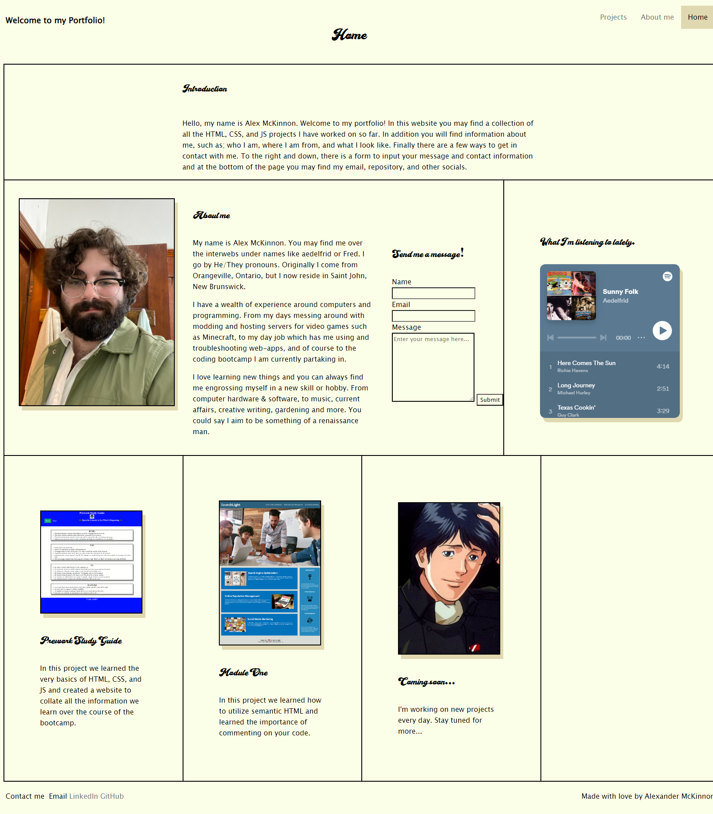

# Planning

## Existing Portfolio

### Styles

## Colours

    #E0D8B0
    #FCFFE7
    #DEA057
    #CE9461

## Fonts

["Blanks Script Font"](https://www.fontspace.com/blanks-script-font-f90252) 

 font-family: 'Lucida Sans', 'Lucida Sans Regular', 'Lucida Grande', 'Lucida Sans Unicode', Geneva, Verdana, sans-serif;

## Mockup

### Colours

    #FAE0C0
    #E2B792
    #E3B052
    #BD6E2A
    #92471C
    #30170D
    #000000

### Fonts

    [Playfair Display](https://fonts.google.com/specimen/Playfair+Display)

### Packages

    React
    Vite
    Tailwind

### Notes

    scrolling transition from section to section
    downlaod resume button fixed to bottom
    carousel for top image
    <a> to deployed link
    carousel for projects, scroll down to go to next project?

## Steps

### Design

    prepare mockup - complete

### Development

#### global styles

#### prepare components

    header, footer
    hero
    about
    skills
    projects
    contact

#### reactive components

    carousel
    transitions
    scroll

### Deployment

    heroku?
    github?
    netlify?

